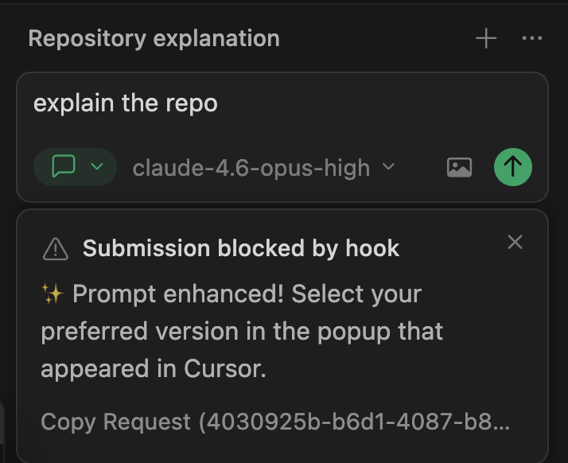
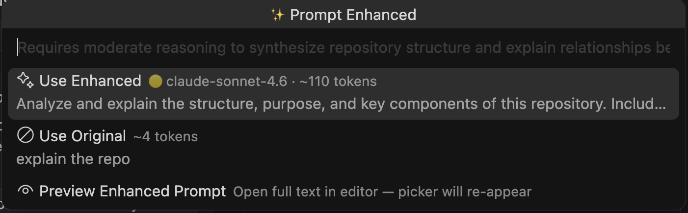
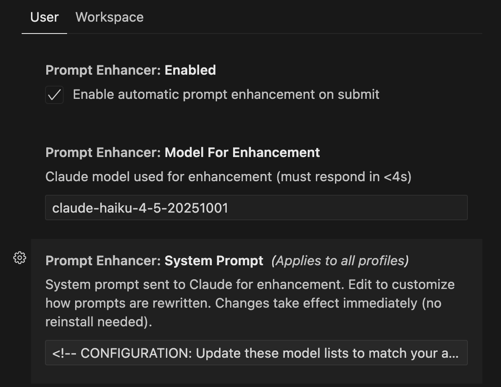

# Cursor Prompt Enhancer

A Cursor extension that automatically enhances your AI prompts before submission — making them clearer, more specific, and more token-efficient — using the Claude API or a local LLM (Ollama).

## How it works

When you submit a prompt in Cursor, the extension:

1. **Intercepts** the prompt via Cursor's `beforeSubmitPrompt` hook
2. **Enhances** it using Claude (fast, cheap Haiku model by default — typically responds in under 2s)
3. **Shows a QuickPick** with the enhanced vs. original prompt, including model recommendation and token estimate
4. **Copies** your selection to the clipboard — paste it back and submit

```
You type:  "fix the auth bug"
Enhanced:  "The JWT refresh logic in src/auth/token.ts fails when the access token
            expires mid-request. Reproduce by logging in, waiting 15 min, then calling
            /api/me. Fix the token refresh race condition and add an integration test.
            think before acting"
```

The extension also recommends which model tier to use for the task (easy/medium/complex), drawing from configurable model lists.

## Screenshots

**1. Hook intercepts the submission**



**2. QuickPick lets you choose enhanced or original**



**3. Fully configurable from Settings**



## Requirements

- [Cursor](https://cursor.com) editor
- Node.js 18+ (used to run the hook script)
- An [Anthropic API key](https://console.anthropic.com/) **or** a local Ollama installation (see [Local LLM Setup](#local-llm-setup-no-api-key-needed))

## Installation

1. Download the latest `.vsix` from the [Releases](https://github.com/ajrcre/cursor-prompt-enhancer/releases) page
2. In Cursor: `Extensions` → `···` → `Install from VSIX…` → select the file
3. Reload the window

## Setup

### Option A — Claude API (cloud)

Run `Prompt Enhancer: Set API Key` from the Command Palette (`Cmd+Shift+P`) and enter your Anthropic API key.

Then run `Prompt Enhancer: Install Hooks` to deploy the hook script to `~/.cursor/hooks/`.

That's it — your next Cursor prompt will be enhanced automatically.

### Option B — Local LLM (no API key needed) {#local-llm-setup-no-api-key-needed}

Run `Prompt Enhancer: Setup Local LLM` from the Command Palette. The command will:

1. **Detect Ollama** — if not installed, a terminal opens with the install script. Run it, enter your password when prompted, then run `Prompt Enhancer: Setup Local LLM` again.
2. **Start Ollama** — launches `ollama serve` in the background automatically.
3. **Download the model** — asks for confirmation before downloading `llama3.2:3b` (~2 GB, one-time). A progress notification shows download status.
4. **Configure automatically** — writes `localLlmEndpoint` and `localLlmModel` to your settings. No API key needed.

Then run `Prompt Enhancer: Install Hooks` if you haven't already.

> **Note:** Local inference uses an 8-second timeout (vs 3.5s for Claude) to accommodate CPU-based machines. On slow hardware, the hook may occasionally pass the prompt through unchanged if the model doesn't respond in time.

## Usage

1. Type a prompt in any Cursor chat (Ask, Agent, or Plan mode)
2. Hit Enter — the prompt is briefly blocked while Claude enhances it
3. A QuickPick appears:
   - **✦ Use Enhanced** — the improved prompt, with model recommendation and token count
   - **⊘ Use Original** — your original prompt unchanged
   - **👁 Preview Full** — opens the complete enhanced text in a side editor, then re-shows the picker
4. Select an option — it's copied to your clipboard
5. Paste (`Cmd+V`) into the chat and submit

> If you press Escape on the QuickPick, nothing happens. The hook already blocked the submission, so you can re-type or re-submit when ready.

## Commands

| Command | Description |
|---|---|
| `Prompt Enhancer: Set API Key` | Store your Anthropic API key securely |
| `Prompt Enhancer: Install Hooks` | Deploy the hook script to `~/.cursor/hooks/` |
| `Prompt Enhancer: Uninstall Hooks` | Remove all hook files and entries |
| `Prompt Enhancer: Edit System Prompt` | Open the enhancement instructions in your editor |
| `Prompt Enhancer: Show Last Result` | Re-show the QuickPick for the most recent enhancement |
| `Prompt Enhancer: Setup Local LLM` | Install Ollama, download `llama3.2:3b`, and configure local mode |

## Configuration

Open Settings (`Cmd+,`) and search for `Prompt Enhancer`.

| Setting | Default | Description |
|---|---|---|
| `promptEnhancer.enabled` | `true` | Enable/disable enhancement |
| `promptEnhancer.modelForEnhancement` | `claude-haiku-4-5-20251001` | Claude model used for enhancement (must respond in <4s) |
| `promptEnhancer.systemPrompt` | *(built-in)* | Instructions sent to Claude. Edit via `Prompt Enhancer: Edit System Prompt` |
| `promptEnhancer.localLlmEndpoint` | *(empty)* | Base URL of a local OpenAI-compatible LLM (e.g. `http://localhost:11434/v1`). Set automatically by `Setup Local LLM`. |
| `promptEnhancer.localLlmModel` | *(empty)* | Model name for the local LLM (e.g. `llama3.2:3b`). Set automatically by `Setup Local LLM`. |

### Customising the system prompt

The built-in system prompt includes configurable model lists at the top:

```
COMPLEX_MODELS: ["claude-opus-4.6", "gpt-5.4-pro"]
MEDIUM_MODELS:  ["claude-sonnet-4.6"]
EASY_MODELS:    ["claude-haiku-4.5", "gpt-5-nano", "gemini-3.1-flash-lite"]
```

Edit these to match the models available in your Cursor account. Run `Prompt Enhancer: Edit System Prompt` to open the full prompt in your editor — changes take effect immediately, no reinstall needed.

## Security

- Your API key is stored in VS Code's encrypted `SecretStorage` and also written to `~/.cursor/hooks/prompt-enhancer-config.json` (readable by the hook subprocess). Keep this file private.
- The hook script (`~/.cursor/hooks/prompt-enhancer.mjs`) runs as a Node.js subprocess on every Cursor prompt submission. You can inspect it at any time.
- **Claude mode:** Prompts are sent to the Anthropic API for enhancement. Do not use this extension with prompts containing credentials, secrets, or sensitive personal data.
- **Local mode:** Prompts are processed entirely on your machine via Ollama — nothing leaves your computer.
- On error or timeout, the hook always passes your prompt through unchanged — you are never permanently blocked.

## How the hook works

The extension deploys a hook script that Cursor runs before every chat submission:

```
Cursor chat → beforeSubmitPrompt hook → Claude API (< 3.5s)
                                      → writes result file
                                      ↓
                         Extension detects new result
                                      ↓
                              QuickPick appears
                                      ↓
                    User selects → skip flag written → clipboard
                                      ↓
              User pastes + submits → hook sees skip flag → pass through ✅
```

Conversation history (last 3 turns) is maintained in `~/.cursor/hooks/prompt-enhancer-history.json` to give Claude context for follow-up prompts like "make that shorter".

## License

MIT
